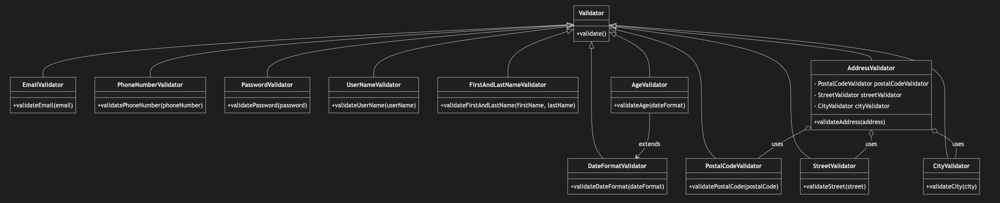
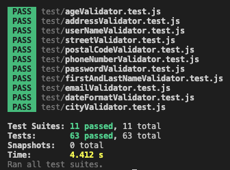

# Validation Module

## Description
This project is a JavaScript module that contains various validators for checking the format of:
- first and last names
- email addresses
- postal codes
- phone numbers
- passwords
- user names
- date formats
- ages
- street names
- cities
- complete addresses.

The module can be used to validate user data in other applications.

## Installation

To download and install the project:

1. Clone the repository and add the modules in your own project:
    ```bash
    git clone https://github.com/elsachica/L2.git
    ```

2. Navigate to the project folder and install the necessary dependencies:
    ```bash
    npm install
    ```
## Main entry point
The main entry point for this module is `validator.js`. This file exports various validator classes from their respective modules. 

## Usage

Once the module is installed, you can import and use the validation classes. Example:

```javascript

import {
  EmailValidator,
  PasswordValidator,
  UserNameValidator,
  PostalCodeValidator,
  PhoneNumberValidator,
  DateFormatValidator,
  AgeValidator,
  StreetValidator,
  CityValidator,
  AddressValidator
} from './path-to-your-module/src/validators/validator.js'

// Create instances of the validators
const emailValidator = new EmailValidator()
const passwordValidator = new PasswordValidator()
const userNameValidator = new UserNameValidator()
const postalCodeValidator = new PostalCodeValidator()
const phoneNumberValidator = new PhoneNumberValidator()
const dateFormatValidator = new DateFormatValidator()
const ageValidator = new AgeValidator()
const streetValidator = new StreetValidator()
const cityValidator = new CityValidator()
const addressValidator = new AddressValidator()

// Example data to validate
const email = 'example@gmail.com'
const password = 'P@ssw0rd'
const userName = 'user_name123'
const postalCode = '12345'
const phoneNumber = '+46701234567'
const date = '1990-01-01'
const age = 30
const street = 'Main Street 123'
const city = 'Stockholm'
const address = {
  street: 'Main Street 123',
  city: 'Stockholm',
  postalCode: '12345'
}

// Perform validations
console.log(emailValidator.validateEmail(email)) // { isValid: true, error: null }
console.log(passwordValidator.validatePassword(password)) // { isValid: true }
console.log(userNameValidator.validateUserName(userName)) // { isValid: true, error: null }
console.log(postalCodeValidator.validatePostalCode(postalCode)) // { isValid: true, error: null }
console.log(phoneNumberValidator.validatePhoneNumber(phoneNumber)) // { isValid: true, error: null }
console.log(dateFormatValidator.validateDateFormat(date)) // { isValid: true, error: null }
console.log(ageValidator.validateAge(age)) // { isValid: true, error: null }
console.log(streetValidator.validateStreet(street)) // { isValid: true, error: null }
console.log(cityValidator.validateCity(city)) // { isValid: true, error: null }
console.log(addressValidator.validateAddress(address)) // { isValid: true, error: null }
```

## Class Diagram


## Validators

The project includes several different classes, each for a specific type of validation. The main entry point is `validator.js`, where you can import the various validators:

- **EmailValidator**: Validates email addresses based on basic format, checks for forbidden characters, and ensures valid domains.
- **PostalCodeValidator**: Handles validation for both Swedish and US postal code formats.
- **PhoneNumberValidator**: Validates both Swedish and US phone numbers.
- **PasswordValidator**: Checks that passwords meet length, character, number, and special character requirements.
- **DateFormatValidator**: Validates two date formats: `YYYY-MM-DD` and `DD/MM/YYYY`.
- **UserNameValidator**: Validates usernames to ensure they are 3 to 16 characters long and contain only letters, numbers, and underscores.
- **AddressValidator**: Validates a complete address by checking the street, city, and postal code.
- **StreetValidator**: Validates street names to ensure they only contain letters, numbers, and spaces.
- **CityValidator**: Validates city names to ensure they only contain letters and spaces.
- **FirstAndLastNameValidator**: Validates first and last names, ensuring they only contain letters and do not exceed a certain length.
- **AgeValidator**: Validates ages to ensure they are within the range of 3 to 120 years.

### File Structure

The validators are organized in the following structure:

```
├── src/
│   ├── validators/
│   │   ├── email/
│   │   │   ├── emailValidator.js
│   │   │   └── index.js
│   │   ├── phoneNumber/
│   │   │   ├── phoneNumberValidator.js
│   │   │   └── index.js
│   │   ├── password/
│   │   │   ├── passwordValidator.js
│   │   │   └── index.js
│   │   ├── userName/
│   │   │   ├── userNameValidator.js
│   │   │   └── index.js
│   │   ├── firstAndLastName/
│   │   │   ├── firstAndLastNameValidator.js
│   │   │   └── index.js
│   │   ├── age/
│   │   │   ├── dateFormatValidator.js
│   │   │   ├── ageValidator.js
│   │   │   └── index.js
│   │   ├── address/
│   │   │   ├── addressValidator.js
│   │   │   ├── postalCodeValidator.js
│   │   │   ├── streetValidator.js
│   │   │   ├── cityValidator.js
│   │   │   └── index.js
│   │   └── validator.js
```


## Test Cases

The project uses Jest to automate testing. Each validator has specific test cases to ensure it works correctly with both valid and invalid inputs. The test files are located in the `tests` folder and are named according to the validator they test.

Examples of test cases:

- **EmailValidator**: Tests that an email is correctly formatted and doesn't contain forbidden characters. (`tests/emailValidator.test.js`)
- **PostalCodeValidator**: Verifies that both US and Swedish postal codes are validated correctly. (`tests/postalCodeValidator.test.js`)
- **PhoneNumberValidator**: Tests phone numbers for both Swedish and US formats. (`tests/phoneNumberValidator.test.js`)
- **PasswordValidator**: Ensures that passwords meet the required length and character rules. (`tests/passwordValidator.test.js`)
- **DateFormatValidator**: Tests if the date formats `YYYY-MM-DD` and `DD/MM/YYYY` are valid. (`tests/dateFormatValidator.test.js`)
- **UserNameValidator**: Ensures that usernames are 3 to 16 characters long and contain only letters, numbers, and underscores. (`tests/userNameValidator.test.js`)
- **AddressValidator**: Tests that a complete address format is valid. (`tests/addressValidator.test.js`)
- **StreetValidator**: Tests that a street name is valid. (`tests/streetValidator.test.js`)
- **CityValidator**: Tests that a city name is valid. (`tests/cityValidator.test.js`)
- **FirstAndLastNameValidator**: Ensures that first and last names are valid. (`tests/firstAndLastNameValidator.test.js`)
- **AgeValidator**: Ensures that ages are valid. (`tests/ageValidator.test.js`)



To run the tests, use the command:
```bash
npm test
```

## Dependencies

The project uses the following dependencies:

- **Jest**: A framework for unit testing JavaScript.
- **ESLint**: A tool to analyze and fix code style issues.
- **Prettier**: A tool for automatically formatting code according to standards.
- **Babel**: Used to compile modern JavaScript into older versions for broader compatibility.

Install all dependencies by running `npm install` as mentioned above.

## Scripts

- `npm start`: Starts the project and runs `src/validators/validator.js`.
- `npm test`: Runs all test cases using Jest.
- `npm run lint`: Analyzes the code using ESLint to find code style issues.
- `npm run lint:fix`: Automatically fixes any code style issues found by ESLint.

## License
This project is licensed under the MIT License - see the LICENSE file for details.

